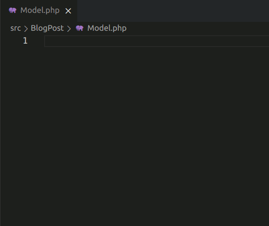

# vscode-php-filegen

Generate basic content of class/interface/trait files based on the project context.

## Features

- Generate a namespaced class/interface/trait in an empty file based on the project context.
- Decides what to generate based on the filename
    - Files starting with "i" get an interface generated (iInterfaceName.php => interface iInterfaceName)
    - Files starting with "t" get a trait generated (tTraitName.php => trait tTraitName)
    - Other files get a class generated (SomeClass.php => class SomeClass)

## Requirements

1. your source files must be in the `src` directory
2. your project must be PSR-4 autoloading configured in `composer.json`
3. currently, your PSR-4 autoloading for `src` must be the first namespace of autoload.psr-4 in composer.json

## Extension Settings

Include if your extension adds any VS Code settings through the `contributes.configuration` extension point.

For example:

This extension contributes the following settings:

* `myExtension.enable`: enable/disable this extension
* `myExtension.thing`: set to `blah` to do something

## Known Issues

Calling out known issues can help limit users opening duplicate issues against your extension.

## Release Notes

Users appreciate release notes as you update your extension.

### 1.0.0

Initial release of ...

### 1.0.1

Fixed issue #.

### 1.1.0

Added features X, Y, and Z.

-----------------------------------------------------------------------------------------------------------
## Following extension guidelines

Ensure that you've read through the extensions guidelines and follow the best practices for creating your extension.

* [Extension Guidelines](https://code.visualstudio.com/api/references/extension-guidelines)

## Working with Markdown

**Note:** You can author your README using Visual Studio Code.  Here are some useful editor keyboard shortcuts:

* Split the editor (`Cmd+\` on macOS or `Ctrl+\` on Windows and Linux)
* Toggle preview (`Shift+CMD+V` on macOS or `Shift+Ctrl+V` on Windows and Linux)
* Press `Ctrl+Space` (Windows, Linux) or `Cmd+Space` (macOS) to see a list of Markdown snippets

### For more information

* [Visual Studio Code's Markdown Support](http://code.visualstudio.com/docs/languages/markdown)
* [Markdown Syntax Reference](https://help.github.com/articles/markdown-basics/)

**Enjoy!**
